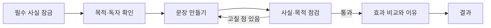

# 초등 교육 웹앱 UX 감사

- 대상: 문장 목적 변환소
- 점검일: 2026-08-31
- 학습자: 초등 5~6학년
- 핵심 학습 계약: 사실을 바꾸지 않고 목적과 독자에 맞게 표현을 변환하고, 그 이유를 근거로 설명한다.
- UI 전문 경로: `design-system`

## 점검 증거

- 기준선: `npm test` 7개 파일·14개 테스트 통과, `npm run build` 통과, `git diff --check` 통과
- 브라우저: 1280px 미션 1 전체 성공·실패 회복 흐름, 320px·375px 좁은 화면, 업데이트 모달 Escape/초점 복귀 확인
- 콘솔: 오류·경고 없음
- 개인정보: 로그인·학생 이름·서버 전송 없음
- VoiceOver 구현·검증: 프로젝트 규칙에 따라 제외

## 분야별 결과

| 분야 | 판정 | 근거 | 개선 |
| --- | --- | --- | --- |
| 학습 논리 | 양호 | 필수 사실 누락·새 사실 추가·목적 요소 부족을 각각 막고 다시 고칠 수 있음 | 기존 판정기와 데이터 계약 보존 |
| 학습 흐름 | P1 | 320px에서 미션/단계 전환 또는 시작 화면 새로고침 뒤 이전 스크롤 위치가 남아 새 제목과 안내가 화면 밖에 위치함 | 첫 진입은 화면 상단으로 이동하고, 단계가 바뀔 때는 상단 이동 + 새 제목에 프로그램 초점 제공 |
| 핵심 행동 강조 | P1 | 사실 잠금·목적/독자 확정 버튼이 비활성 상태일 때 `gi-pulse`가 적용됨 | 준비 완료된 활성 버튼만 강조, 비활성 애니메이션 방어 규칙 추가 |
| 인지 부하 | P2 | 목적·독자가 정해진 미션에도 선택할 수 없는 카드가 모두 보임 | 고정된 값 한 장만 보여 주고 설명은 유지 |
| 키보드 | P2 | 화살표 키로 라디오 선택 값은 바뀌지만 초점은 이전 카드에 남음 | 선택 값과 실제 초점을 함께 이동 |
| 접근 가능한 이름 | P2 | 근거 틀 선택 버튼이 `t1`, `t2` 같은 내부 ID를 읽음 | 화면 순서 기반의 사람 친화적 이름으로 교체 |
| 학생 언어 | P2 | 업데이트 내역에 `gi-pulse`, `44px`, `모달` 같은 개발 용어가 노출됨 | 학생이 이해하는 행동 중심 문장으로 교체 |
| 좁은 화면 헤더 | P3 | 320px에서 제목과 업데이트 버튼이 좁게 압축되어 여러 줄이 됨 | 359px 이하에서 헤더를 세로 배치하고 버튼 줄바꿈 방지 |
| 시각 체계 | 양호 | 밝은 종이색 바탕, 한 가지 산호색 강조, 명확한 목적별 태그, 일관된 토큰 사용 | 현재 팔레트와 토큰 유지, 새 임의 색상·의존성 금지 |
| 코드 구조 | 양호 | React/Vite/TypeScript, 코드 파일 500줄 미만, 기능별 컴포넌트 분리 | 전환 초점 로직을 재사용 컴포넌트로 분리 |
| 개발 런타임 | P3 | `ChangelogModal.tsx`가 컴포넌트와 훅을 함께 내보내 HMR 때 Fast Refresh 경고와 전체 재로딩이 발생함 | `useChangelog` 훅을 별도 파일로 분리 |
| 구성·배포 | 양호 | GitHub Pages 저장소 경로를 동적으로 계산하고 정적 SPA 경계를 지킴 | 이번 범위에서는 구성 변경 없음 |
| 콘텐츠 | 양호 | 가상 학교 사실을 쓰고 원문-사실 단위-표현 조각 연결을 테스트함 | 사실·정답 데이터는 변경하지 않음 |

## 학생 관점 핵심 발견

학습 논리는 위 회복 루프를 올바르게 제공하지만, 좁은 화면에서는 단계가 바뀐 사실을 시각적으로 알아차리기 어렵습니다. 이번 개선은 학습 판정 자체가 아니라 각 단계의 시작점과 다음 행동을 분명하게 만드는 데 집중합니다.

## 유지해야 할 장점

- 오답을 단순히 “틀림”으로 끝내지 않고 누락 사실·새 사실·목적 요소를 구체적으로 알려 줌
- 문장 조각을 다시 배열·삭제·되돌릴 수 있어 안전하게 탐색 가능
- 44px 이상 조작 영역, 명확한 상태 문구, 모달 초점 가두기와 Escape 닫기 제공
- `prefers-reduced-motion`에서 애니메이션을 제거함
- 결과 복사는 학생이 직접 눌렀을 때만 실행됨
